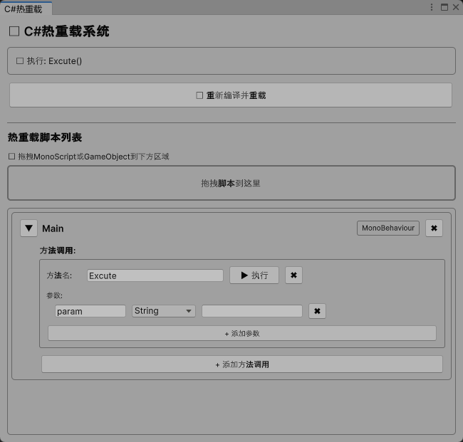

# Unity Runtime Hot Reload System

[English](#english) | [中文](#中文)

---

## English

A powerful runtime hot reload system for Unity that allows you to modify and reload C# scripts without stopping Play mode.

### ✨ Features

- 🔥 **Runtime Hot Reload**: Modify code while the game is running
- 🔄 **MonoBehaviour Support**: Automatically replace MonoBehaviour components on GameObjects
- 💾 **State Preservation**: Saves and restores field data during reload
- 🎯 **Method Execution**: Execute methods directly from the editor with custom parameters
- 🛠️ **Roslyn Compiler**: Uses Microsoft Roslyn for dynamic compilation
- 📝 **Visual Editor**: Drag-and-drop interface for managing scripts and methods

### 📋 Requirements

- Unity 2022.3 or later
- .NET Framework 4.7.1 or later
- NuGetForUnity package

### 🚀 Installation

1. **Install NuGetForUnity**
   - Add via Package Manager: `https://github.com/GlitchEnzo/NuGetForUnity.git?path=/src/NuGetForUnity`

2. **Install Required NuGet Packages**
   - Open `NuGet > Manage NuGet Packages`
   - Install the following packages:
     - `Microsoft.CodeAnalysis.CSharp` (5.0.0)
     - `Microsoft.CodeAnalysis.Common` (5.0.0)
     - And their dependencies (automatically installed)

3. **Clone or Download this Repository**
   ```bash
   git clone https://github.com/yourusername/unity-hot-reload.git
   ```

4. **Copy the Following Folders to Your Unity Project**
   - `Assets/Editor/HotReload/`
   - `Assets/Scripts/Utils/HotReload/`

### 📖 Usage

#### Opening the Hot Reload Window

1. In Unity Editor, go to `Tools > Simple Hot Reload > 打开热重载窗口`
2. The Hot Reload window will appear

#### Adding Scripts for Hot Reload

1. **Drag and drop** a MonoScript or GameObject into the drop area
2. The script will be added to the hot reload list
3. Configure method calls if needed

#### Reloading Scripts

1. **Enter Play Mode** in Unity
2. Modify your C# script (add methods, change logic, etc.)
3. Click the **"🔄 重新编译并重载"** button in the Hot Reload window
4. The system will:
   - Compile the new code using Roslyn
   - Replace MonoBehaviour components on GameObjects
   - Preserve field data
   - Make new methods available immediately

#### Executing Methods

1. Add a method call in the script's configuration
2. Set the method name and parameters
3. Click the **"▶ 执行"** button to run the method

### ⚠️ Important Limitations

#### Debugging Limitations
- **Breakpoints will NOT work** on hot-reloaded code
- The debugger is attached to the original assembly, not the dynamically compiled one
- For debugging, stop Play mode, modify code, and restart

#### MonoBehaviour Limitations
- Component references may be lost during reload
- Complex serialized data may not fully restore
- For best results, use plain C# classes (non-MonoBehaviour) for hot reload

### 🎯 Best Practices

**Use Hot Reload For:**
- ✅ Rapid iteration on game logic
- ✅ Testing UI behavior
- ✅ Adjusting parameters and values
- ✅ Quick prototyping

**Don't Use Hot Reload For:**
- ❌ Debugging with breakpoints
- ❌ Complex bug investigation
- ❌ Performance profiling
- ❌ Production builds

### 📦 Dependencies

This project uses the following NuGet packages:

- Microsoft.CodeAnalysis.CSharp (5.0.0)
- Microsoft.CodeAnalysis.Common (5.0.0)
- System.Collections.Immutable (9.0.0)
- System.Reflection.Metadata (9.0.0)
- System.Runtime.CompilerServices.Unsafe (6.1.0)
- System.Text.Encoding.CodePages (8.0.0)
- And other dependencies (see `packages.config`)

### 🤝 Contributing

Contributions are welcome! Please feel free to submit a Pull Request.

### 📄 License

This project is licensed under the MIT License - see the [LICENSE](LICENSE) file for details.

### 🙏 Acknowledgments

- Built with [Microsoft Roslyn](https://github.com/dotnet/roslyn)
- Uses [NuGetForUnity](https://github.com/GlitchEnzo/NuGetForUnity)

---

## 中文

一个强大的Unity运行时热重载系统，允许你在不停止Play模式的情况下修改和重载C#脚本。

### ✨ 特性

- 🔥 **运行时热重载**：在游戏运行时修改代码
- 🔄 **MonoBehaviour支持**：自动替换GameObject上的MonoBehaviour组件
- 💾 **状态保存**：重载时保存并恢复字段数据
- 🎯 **方法执行**：直接从编辑器执行方法，支持自定义参数
- 🛠️ **Roslyn编译器**：使用Microsoft Roslyn进行动态编译
- 📝 **可视化编辑器**：拖放式界面管理脚本和方法

### 📋 系统要求

- Unity 2022.3 或更高版本
- .NET Framework 4.7.1 或更高版本
- NuGetForUnity 包

### 🚀 安装步骤

1. **安装 NuGetForUnity**
   - 通过Package Manager添加：`https://github.com/GlitchEnzo/NuGetForUnity.git?path=/src/NuGetForUnity`

2. **安装所需的NuGet包**
   - 打开 `NuGet > Manage NuGet Packages`
   - 安装以下包：
     - `Microsoft.CodeAnalysis.CSharp` (5.0.0)
     - `Microsoft.CodeAnalysis.Common` (5.0.0)
     - 以及它们的依赖项（会自动安装）

3. **克隆或下载此仓库**
   ```bash
   git clone https://github.com/yourusername/unity-hot-reload.git
   ```

4. **复制以下文件夹到你的Unity项目**
   - `Assets/Editor/HotReload/`
   - `Assets/Scripts/Utils/HotReload/`

### 📖 使用方法

#### 打开热重载窗口

1. 在Unity编辑器中，选择 `Tools > Simple Hot Reload > 打开热重载窗口`
2. 热重载窗口将会出现

#### 添加需要热重载的脚本

1. **拖放** MonoScript或GameObject到拖放区域
2. 脚本将被添加到热重载列表
3. 如需要，配置方法调用

#### 重载脚本

1. 在Unity中**进入Play模式**
2. 修改你的C#脚本（添加方法、修改逻辑等）
3. 点击热重载窗口中的 **"🔄 重新编译并重载"** 按钮
4. 系统将会：
   - 使用Roslyn编译新代码
   - 替换GameObject上的MonoBehaviour组件
   - 保留字段数据
   - 立即使新方法可用

#### 执行方法

1. 在脚本配置中添加方法调用
2. 设置方法名和参数
3. 点击 **"▶ 执行"** 按钮运行方法

### ⚠️ 重要限制

#### 调试限制
- 热重载的代码**无法使用断点**
- 调试器附加到原始程序集，而不是动态编译的程序集
- 如需调试，请停止Play模式，修改代码后重新启动

#### MonoBehaviour限制
- 重载时组件引用可能会丢失
- 复杂的序列化数据可能无法完全恢复
- 为获得最佳效果，建议使用纯C#类（非MonoBehaviour）进行热重载

### 🎯 最佳实践

**适合使用热重载的场景：**
- ✅ 快速迭代游戏逻辑
- ✅ 测试UI行为
- ✅ 调整参数和数值
- ✅ 快速原型开发

**不适合使用热重载的场景：**
- ❌ 需要断点调试
- ❌ 复杂bug调查
- ❌ 性能分析
- ❌ 生产构建

### 📦 依赖项

本项目使用以下NuGet包：

- Microsoft.CodeAnalysis.CSharp (5.0.0)
- Microsoft.CodeAnalysis.Common (5.0.0)
- System.Collections.Immutable (9.0.0)
- System.Reflection.Metadata (9.0.0)
- System.Runtime.CompilerServices.Unsafe (6.1.0)
- System.Text.Encoding.CodePages (8.0.0)
- 以及其他依赖项（见 `packages.config`）

### 🤝 贡献

欢迎贡献！请随时提交Pull Request。

### 📄 许可证

本项目采用MIT许可证 - 详见 [LICENSE](LICENSE) 文件。

### 🙏 致谢

- 使用 [Microsoft Roslyn](https://github.com/dotnet/roslyn) 构建
- 使用 [NuGetForUnity](https://github.com/GlitchEnzo/NuGetForUnity)

---

## 📸 Screenshots / 截图

### Hot Reload Effect / 热重载效果


### Hot Reload Window / 热重载窗口


### Method Execution / 方法执行


---

## 🐛 Known Issues / 已知问题

1. **Breakpoints don't work** on hot-reloaded code (by design)
2. **Component references** may be lost during MonoBehaviour reload
3. **Complex serialized data** may not fully restore

**断点在热重载的代码上不起作用**（设计如此）
**组件引用**在MonoBehaviour重载时可能丢失
**复杂的序列化数据**可能无法完全恢复

---

## 📞 Support / 支持

If you encounter any issues or have questions, please [open an issue](https://github.com/yourusername/unity-hot-reload/issues).

如果遇到任何问题或有疑问，请[提交issue](https://github.com/yourusername/unity-hot-reload/issues)。